# UX Design Specification BP-AI

**Author:** Pierre
**Date:** 2026-01-27

---

## Executive Summary

### Project Vision

BP-AI is the "10x CFO" - an AI-powered financial analytics platform that transforms scattered financial data into instant clarity. By connecting to Penny Lane (invoices, payments, accounting) and PayFit (payroll, org structure), it delivers a unified revenue intelligence dashboard that eliminates spreadsheet dependency.

The core differentiator is trust through recognition: users see familiar client names, accurate numbers, and can drill from ARR down to individual invoices. When the data matches reality, that's the "aha" moment.

### Target Users

| Persona | Role | Primary Goal | Key Moment |
|---------|------|--------------|------------|
| **CFO Marie** | Financial oversight | Board meeting prep with confidence | Screenshots ARR projection, saves 90 minutes |
| **CEO David** | Strategic leadership | Answer "How's Q1?" in 3 minutes | Texts investor with chart between meetings |
| **Accountant Thomas** | Data validation | Verify edges and recent changes | Runs out of things to catch, uncrosses arms |
| **Investor Sarah** | Due diligence | Find what founders might hide | Finds nothing hidden, recommends moving forward |
| **Admin Alex** | IT/Operations | Set up integrations quickly | 15-minute setup, no support ticket needed |

### Key Design Challenges

1. **Trust at First Glance** - The UI must instantly surface recognizable data to earn skeptical users' trust
2. **Density vs. Clarity** - Show comprehensive financial data without cognitive overload
3. **Speed as Emotional Reassurance** - Sub-3-second loads reduce anxiety, not just improve metrics
4. **Multi-Persona, Single Interface** - One dashboard serving CFO strategy to Accountant invoice-level needs
5. **Mobile-First Quick Answers** - CEO needs 60-second answers on phone between meetings

### Design Opportunities

1. **Progressive Disclosure as Signature Pattern** - Calm surface, infinite depth through hover/click/drill-down
2. **Quarter Milestones as Navigation** - Projection charts become both visualization and interaction points
3. **Trust Anchors** - Strategically placed recognition moments (biggest client, recent transactions) validate continuously
4. **Zero-Config Beautiful Defaults** - "It just works beautifully from day one" as competitive advantage

## Core User Experience

### Defining Experience

The core BP-AI experience is **"Glance → Drill → Verify"**:

1. **Glance**: User lands on Revenue Command Center, sees ARR and key metrics instantly
2. **Drill**: Click any number to reveal the breakdown (by product, by client, by time)
3. **Verify**: Drill to source data (individual invoices) to confirm accuracy

This loop serves all personas: CFO gets the overview, Accountant verifies the edges, CEO screenshots Q1, Investor checks concentration risk - all using the same pattern at different depths.

### Platform Strategy

| Aspect | Decision | Rationale |
|--------|----------|-----------|
| **Primary Platform** | Web dashboard | Where financial work happens |
| **Mobile** | Nice-to-have only | Not MVP priority; if responsive works, bonus |
| **Input Method** | Mouse/keyboard | Desktop-first interaction design |
| **Offline** | Not required | Financial data must be current |
| **Browser Support** | Modern browsers | Chrome, Firefox, Safari, Edge |

**MVP Focus:** Get the web dashboard right. Data extraction and accuracy are the hard problems - not multi-platform support.

### Effortless Interactions

| Interaction | Must Feel Effortless |
|-------------|---------------------|
| **First load** | Instant. No spinners. Data appears. |
| **Drill-down** | One click reveals next level. No page loads. |
| **Time navigation** | M/Q/Y toggle updates view instantly |
| **Finding a client** | Search returns results as you type |
| **Understanding a number** | Hover shows context, click shows detail |

### Critical Success Moments

| Moment | What Happens | Why It Matters |
|--------|--------------|----------------|
| **First View** | User sees ARR and recognizes their biggest client | Trust is established or lost here |
| **First Drill** | Click ARR → see client breakdown → numbers add up | Proves the depth is real |
| **Validation Test** | User checks a recent change they know about | Accountant's "arms uncross" moment |
| **Quick Answer** | User finds answer to "How's Q1?" in under 60 seconds | Core value proposition proven |

### Experience Principles

1. **Trust in 3 Seconds** - First view shows recognizable, accurate data instantly
2. **Glance → Drill → Verify** - Core loop: overview → breakdown → source data
3. **Answers, Not Dashboards** - UI feels like getting answers to questions
4. **Depth Exists, Complexity Hides** - Calm surface, one-click access to detail
5. **Data is the Feature** - Accuracy trumps aesthetics; recognition is the "wow"

## Desired Emotional Response

### Primary Emotional Goals

| Emotion | Description | Why It Matters |
|---------|-------------|----------------|
| **Trust** | "This data is correct" | Core differentiator - users trust BP-AI because they recognize their own data |
| **Relief** | "I don't have to dig through spreadsheets" | Transforms a stressful task into a confident glance |
| **Confidence** | "I can answer any financial question" | Users feel empowered, not dependent on tools |
| **Control** | "I can go as deep as I need" | Progressive disclosure gives users agency |

### Emotional Journey Map

| Stage | From (Spreadsheets) | To (BP-AI) | Design Implication |
|-------|---------------------|------------|-------------------|
| **First Open** | "Ugh, where's that file..." | "Ah, there it is." | Instant load, no navigation required |
| **First Glance** | Overwhelm, where to look? | Recognition, familiar data | Surface biggest clients, key metrics prominently |
| **Finding Answer** | Anxiety while hunting | Confidence at a glance | Answer visible without clicking |
| **Drilling Down** | Fear of broken formulas | Trust in source data | Every number traceable to invoice |
| **Sharing** | Worry about accuracy | Pride in clarity | Screenshot-ready charts |
| **Returning** | Dread the task | Routine comfort | Consistent, predictable interface |

### Micro-Emotions

**Must Cultivate:**
- **Trust over Skepticism** - Accountant Thomas tests the edges; they must hold
- **Confidence over Confusion** - Every number self-explanatory, no "what does this mean?"
- **Relief over Anxiety** - Speed is emotional; 3-second load = calm, spinner = stress amplified
- **Pride over Embarrassment** - CFO can screenshot and share without fear of errors

**Must Avoid:**
- **Doubt** - "Is this number right?" = failure
- **Frustration** - "Where is that client?" = search must be instant
- **Overwhelm** - Too much data visible = cognitive overload
- **Abandonment** - Reverting to spreadsheet = complete failure

### Emotion-to-Design Mapping

| Desired Emotion | UX Design Approach |
|-----------------|-------------------|
| **Trust** | Show recognizable client names on first view; every number drills to source |
| **Relief** | Instant load; no spinners; pre-computed data |
| **Confidence** | Clear labels; self-describing metrics; no jargon |
| **Control** | Progressive disclosure; user decides depth; nothing forced |
| **Pride** | Beautiful, screenshot-ready charts; professional aesthetic |

### Emotional Design Principles

1. **Speed is Emotional** - Sub-3-second loads reduce anxiety, not just improve metrics
2. **Recognition Builds Trust** - Familiar client names visible immediately validate the system
3. **Depth Without Overwhelm** - Complexity exists but hides until summoned
4. **Every Number Earns Trust** - Drill to source removes doubt; no black boxes
5. **Professional Confidence** - Aesthetic supports sharing with investors, boards, stakeholders

## UX Pattern Analysis & Inspiration

### Inspiring Products Analysis

| Product | Core UX Strength | What to Adopt | What to Avoid |
|---------|-----------------|---------------|---------------|
| **Apple (General Philosophy)** | Simplicity that feels inevitable; calm, confident design; "it just works" | Visual restraint, whitespace, typography hierarchy, polish | Over-simplification that hides necessary functionality |
| **Stripe Dashboard** | Beautiful AND functional; data-dense yet clear | Dual metrics display, clean data visualization, instant interactions | Developer-centric complexity |
| **Notion** | Progressive disclosure mastered; depth without overwhelm | Hover reveals, consistent frame, toggle-based navigation | User customization expectations |
| **Bloomberg Terminal** | Information density for power users | Event-based alerts, comparison views | Steep learning curve, keyboard-first interface |
| **Plaid** | Integration health visibility; transparent system status | Connection status indicators, smart error messaging | - |

### Key Design Philosophy

**The BP-AI Balance:**
> "Apple simplicity on the surface, Stripe depth underneath"

- First impression: Clean, calm, confident (Apple)
- On interaction: Rich, powerful, complete (Stripe)
- Navigation model: Progressive disclosure (Notion)

**The Danger Zone:**
- Too Apple = Users can't find functionality
- Too Bloomberg = Users feel overwhelmed
- BP-AI must be = Obvious at first glance, powerful on demand

### Transferable UX Patterns

**From Apple:**
| Pattern | Application to BP-AI |
|---------|---------------------|
| Visual restraint | Whitespace around key metrics; not every pixel filled |
| Typography hierarchy | ARR large and bold; supporting metrics secondary |
| Inevitable design | Interface feels like "the only way it could be" |
| Polish as trust signal | Refinement signals competence with financial data |

**From Stripe:**
| Pattern | Application to BP-AI |
|---------|---------------------|
| Dual metric display | ARR + Cash in bank, always visible |
| Data visualization clarity | Charts that explain themselves |
| Instant interactions | No page loads, immediate response |
| Depth on demand | Click any number → full breakdown |

**From Notion:**
| Pattern | Application to BP-AI |
|---------|---------------------|
| Progressive disclosure | Hover shows preview, click shows detail |
| Consistent frame | Same layout, different data focus |
| Time-based toggles | M/Q/Y switches view instantly |
| Breadcrumb trail | Revenue → Product → Client → Invoice |

### Anti-Patterns to Avoid

| Anti-Pattern | Why It Fails for BP-AI |
|--------------|----------------------|
| **Dashboard overwhelm** | Too many widgets, charts, numbers = cognitive overload |
| **Hidden functionality** | Over-simplified Apple-ism where users can't find features |
| **Customization burden** | Asking users to "set up their dashboard" = they won't |
| **Loading spinners** | Any wait = anxiety amplified (financial data stress) |
| **Unexplained numbers** | Jargon or unlabeled metrics = doubt |
| **Click-heavy navigation** | More than 3 clicks to source data = abandonment |

### Design Inspiration Strategy

**Adopt Fully:**
- Apple's visual restraint and typography hierarchy
- Stripe's balance of beauty + functionality
- Notion's progressive disclosure pattern
- Plaid's connection health transparency

**Adapt for Context:**
- Stripe's data density → simplified for occasional-use CFOs (not daily traders)
- Notion's toggle navigation → applied to M/Q/Y time periods
- Apple's polish → applied to chart/screenshot readiness

**Actively Reject:**
- Bloomberg's complexity (users won't live in this app)
- Apple's sometimes-excessive simplicity (functionality must be findable)
- Generic BI tool aesthetic (blank canvas, configuration required)

**The North Star:**
> "A CFO opens BP-AI and thinks: 'Finally, someone designed this for me.' It feels as polished as Apple, as powerful as Stripe, and as intuitive as Notion."

## Design System Foundation

### Design System Choice

**Primary Stack: Tailwind CSS + shadcn/ui**

| Component | Choice | Rationale |
|-----------|--------|-----------|
| **CSS Framework** | Tailwind CSS | Utility-first, highly customizable, Apple-like aesthetics achievable |
| **Component Library** | shadcn/ui | Copy-paste components, unstyled primitives, full control |
| **Chart Library** | Tremor or Recharts | Tailwind-native, financial dashboard optimized |
| **Icons** | Lucide Icons | Clean, consistent, shadcn/ui default |

### Rationale for Selection

**Why Tailwind + shadcn/ui for BP-AI:**

1. **Apple Aesthetic Achievable** - Utility classes make it easy to achieve visual restraint, whitespace, and typography hierarchy without fighting framework opinions

2. **Solo Developer Optimized** - Copy-paste components from shadcn/ui; no complex library configuration; iterate fast

3. **Dashboard-Ready** - Excellent integration with chart libraries (Tremor is built on Tailwind); data tables, cards, and metrics components readily available

4. **Customization Without Friction** - Can achieve unique BP-AI look while leveraging proven accessible components

5. **Performance** - Tailwind purges unused CSS; shadcn/ui components are lightweight; supports instant load goal

### Implementation Approach

**Phase 1: Foundation Setup**
- Tailwind CSS configuration with custom color palette
- shadcn/ui component installation (as needed, not bulk import)
- Design tokens defined (spacing, typography, colors)
- Base layout structure (consistent frame pattern)

**Phase 2: Core Components**
- Metric cards (ARR, Cash, Projections)
- Data tables (client lists, invoice details)
- Charts (revenue trends, quarter projections)
- Navigation (M/Q/Y toggles, drill-down breadcrumbs)

**Phase 3: Interaction Patterns**
- Hover states (progressive disclosure previews)
- Click-to-expand patterns
- Search with instant results
- Loading states (skeleton, not spinner)

### Customization Strategy

**Design Tokens to Define:**

| Token Category | Purpose |
|----------------|---------|
| **Colors** | Primary (trust/professional), Success (positive metrics), Warning (attention needed), Neutral (backgrounds, borders) |
| **Typography** | Large metrics (ARR display), Labels, Body text, Secondary text |
| **Spacing** | Generous whitespace (Apple pattern), Consistent card padding |
| **Shadows** | Subtle elevation for cards, hover states |
| **Border Radius** | Consistent rounding (modern, approachable) |

**Component Customizations:**

| Component | BP-AI Customization |
|-----------|---------------------|
| **Cards** | Generous padding, subtle shadow, hover elevation |
| **Tables** | Clean rows, clickable for drill-down, minimal borders |
| **Charts** | Quarter milestone markers, M/Q/Y toggle integration |
| **Buttons** | Minimal, icon-forward for actions |
| **Search** | Prominent, instant results dropdown |

### Chart Library Decision

**Recommendation: Tremor**

| Reason | Benefit |
|--------|---------|
| Built for Tailwind | Seamless integration, consistent styling |
| Dashboard-focused | Area charts, bar charts, metrics out of the box |
| Financial-ready | Number formatting, trend indicators, KPI cards |
| Lightweight | Doesn't bloat bundle size |

Alternative: Recharts if more customization needed for complex visualizations.

## Defining Experience (Detailed)

### The Core Interaction

**BP-AI's Defining Experience:**
> "See your revenue, click to understand why"

If a CFO describes BP-AI to another CFO:
> "You open it, see your ARR, click any number, and you can trace it all the way down to the invoice. And it's fast."

This is the interaction that, if nailed, makes everything else follow. Every design decision should support this core loop.

### User Mental Model

**How Users Currently Think (Spreadsheets):**

| Task | Spreadsheet Mental Model | BP-AI Mental Model |
|------|--------------------------|-------------------|
| **Find revenue** | Open file → find tab → locate cell | Open BP-AI → it's there |
| **Understand breakdown** | Cross-reference columns, filter | Click the number |
| **Verify accuracy** | Check formulas, trace dependencies | Drill to invoice |
| **Answer questions** | Hunt, calculate, double-check | Glance, click if needed |

**Mental Model Shift:**
- From "Where is it?" → To "It's right there"
- From "How do I calculate this?" → To "Click to see the breakdown"
- From "Is this formula right?" → To "Drill to the source"

**Familiar Patterns Users Bring:**
- Click = more detail (universal web convention)
- Bigger = more important (visual hierarchy)
- Time toggles (M/Q/Y) = familiar dashboard pattern
- Numbers should add up when drilling down

### Success Criteria

| Criterion | Target | Why It Matters |
|-----------|--------|----------------|
| **Recognition Speed** | Familiar client name visible in <3 seconds | Trust established immediately |
| **Data Accuracy** | Within 5% of source systems | Core value proposition |
| **Load Time** | Dashboard renders in <3 seconds | Speed = emotional reassurance |
| **Drill Depth** | Invoice-level in ≤3 clicks | Verification must be effortless |
| **Self-Explanation** | Zero "what does this mean?" moments | Confidence without training |

**User Success Indicators:**
- User nods when they see ARR (recognition)
- User clicks to drill without hesitation (intuitive)
- User stops checking the spreadsheet (trust established)
- User screenshots for board deck (pride in clarity)

### Pattern Analysis

**Approach: Established Patterns, Innovative Execution**

| Pattern Type | What We Use | Our Innovation |
|--------------|-------------|----------------|
| **Click-to-drill** | Standard BI pattern | Speed that feels magical (pre-computed) |
| **Progressive disclosure** | Proven (Notion, Apple) | Trust anchors surface automatically |
| **Time toggles** | Familiar dashboard convention | Quarter milestones as navigation |
| **Data hierarchy** | Standard visualization | Depth without complexity |

**Why This Works:**
- No user education needed - patterns are familiar
- Innovation is in speed, accuracy, and trust - not interaction novelty
- Users feel smart immediately, not after learning curve

### Experience Mechanics

**The Glance → Drill → Verify Loop:**

```
┌─────────────────────────────────────────────────────────────┐
│  GLANCE                                                      │
│  User opens BP-AI → Revenue Command Center appears          │
│  ARR prominent, familiar client names visible               │
│  Time: <3 seconds │ Emotion: Recognition, relief            │
└─────────────────────────────────────────────────────────────┘
                              │
                              ▼
┌─────────────────────────────────────────────────────────────┐
│  DRILL                                                       │
│  User clicks any number → Breakdown appears instantly       │
│  By client, by product, by time period                      │
│  Time: Instant │ Emotion: "This is powerful"                │
└─────────────────────────────────────────────────────────────┘
                              │
                              ▼
┌─────────────────────────────────────────────────────────────┐
│  VERIFY                                                      │
│  User drills to invoice level → Source data visible         │
│  Numbers trace to origin, match reality                     │
│  Time: ≤3 clicks │ Emotion: Trust earned                    │
└─────────────────────────────────────────────────────────────┘
```

**Detailed Mechanics:**

| Phase | User Action | System Response | Feedback |
|-------|-------------|-----------------|----------|
| **Initiation** | Opens BP-AI | Dashboard appears instantly | No loading state |
| **Recognition** | Scans for familiar data | ARR + top clients visible | "This looks right" |
| **Curiosity** | Hovers on metric | Preview tooltip appears | Context without commitment |
| **Exploration** | Clicks number | Breakdown panel slides in | Smooth, instant transition |
| **Deep Dive** | Clicks client | Client profile with invoices | Full history accessible |
| **Verification** | Checks specific invoice | Invoice detail matches source | Trust earned |
| **Exit** | Got their answer | State preserved for return | Can pick up where left off |

**Error States:**

| Scenario | Response | Emotion Goal |
|----------|----------|--------------|
| Data sync issue | Clear status indicator, not blocking | Informed, not alarmed |
| No data for period | Helpful empty state, not error | Understood, not confused |
| Search no results | Suggest alternatives | Guided, not stuck |

## Visual Design Foundation

### Color System

**Philosophy:** Modern neutral foundation with Violet accent - distinctive, memorable, and unexpected in finance. Signals "this is different" while remaining professional.

**Why Violet:**
- Unexpected in finance = memorable and distinctive
- Proven by Stripe for financial data
- Works beautifully in both light and dark modes
- Modern tech feel without being cold

#### Core Palette

| Role | Light Mode | Dark Mode | Tailwind Class |
|------|------------|-----------|----------------|
| **Primary (Violet)** | `#8B5CF6` | `#A78BFA` | `violet-500` / `violet-400` |
| **Primary Hover** | `#7C3AED` | `#C4B5FD` | `violet-600` / `violet-300` |
| **Background** | `#FFFFFF` | `#0F172A` | `white` / `slate-900` |
| **Surface** | `#F8FAFC` | `#1E293B` | `slate-50` / `slate-800` |
| **Text Primary** | `#0F172A` | `#F8FAFC` | `slate-900` / `slate-50` |
| **Text Secondary** | `#64748B` | `#94A3B8` | `slate-500` / `slate-400` |
| **Border** | `#E2E8F0` | `#334155` | `slate-200` / `slate-700` |

#### Semantic Colors

| Purpose | Light Mode | Dark Mode | Usage |
|---------|------------|-----------|-------|
| **Success** | `#22C55E` | `#4ADE80` | Positive metrics, growth indicators |
| **Warning/Highlight** | `#F59E0B` | `#FBBF24` | Attention needed, key callouts |
| **Error** | `#EF4444` | `#F87171` | Negative metrics, churn, issues |
| **Info** | `#8B5CF6` | `#A78BFA` | Links, interactive elements |

#### Color Usage Guidelines

| Element | Color Application |
|---------|-------------------|
| **ARR & Key Metrics** | Text in primary text color; trend indicator uses semantic colors |
| **Charts - Positive** | Violet primary for main data; Success green for growth |
| **Charts - Negative** | Error red for churn/decline |
| **Interactive Elements** | Violet for clickable items, hover states |
| **Cards** | Surface background, subtle border |
| **Metric Highlights** | Amber for "attention" callouts |

### Typography System

**Primary Font:** Inter
- Clean, modern, excellent readability
- Open source, widely available
- Perfect pairing with Tailwind

**Fallback Stack:** `Inter, -apple-system, BlinkMacSystemFont, "Segoe UI", Roboto, sans-serif`

#### Type Scale

| Element | Size | Weight | Line Height | Usage |
|---------|------|--------|-------------|-------|
| **Metric Display** | 48px (3rem) | Semibold (600) | 1 | ARR, primary numbers |
| **Metric Secondary** | 32px (2rem) | Semibold (600) | 1.1 | Cash, secondary metrics |
| **H1 / Page Title** | 30px (1.875rem) | Semibold (600) | 1.2 | Page headers |
| **H2 / Section** | 24px (1.5rem) | Semibold (600) | 1.3 | Section titles |
| **H3 / Card Title** | 20px (1.25rem) | Medium (500) | 1.4 | Card headers |
| **Body** | 16px (1rem) | Regular (400) | 1.5 | General content |
| **Body Small** | 14px (0.875rem) | Regular (400) | 1.5 | Secondary content |
| **Caption** | 12px (0.75rem) | Medium (500) | 1.4 | Labels, timestamps |

#### Typography Principles

1. **Metrics are heroes** - Large, bold, impossible to miss
2. **Labels are quiet** - Support the numbers, don't compete
3. **Hierarchy through weight** - Semibold for important, regular for supporting
4. **Consistent rhythm** - Same sizes across similar elements

### Spacing & Layout Foundation

**Base Unit:** 4px
**Spacing Scale:** 4, 8, 12, 16, 24, 32, 48, 64, 96px

#### Spacing Tokens

| Token | Value | Tailwind | Usage |
|-------|-------|----------|-------|
| **xs** | 4px | `p-1` | Tight internal spacing |
| **sm** | 8px | `p-2` | Compact elements |
| **md** | 16px | `p-4` | Default component spacing |
| **lg** | 24px | `p-6` | Card padding, section gaps |
| **xl** | 32px | `p-8` | Major section separation |
| **2xl** | 48px | `p-12` | Page-level spacing |
| **3xl** | 64px | `p-16` | Hero sections |

#### Layout Principles

| Principle | Implementation |
|-----------|----------------|
| **Generous whitespace** | Cards: 24px padding; Sections: 48px gaps |
| **Breathing room** | Metrics never cramped; space = confidence |
| **Visual hierarchy** | More important = more space around it |
| **Consistent rhythm** | Same spacing for similar elements |

#### Card System

| Property | Value | Tailwind Classes |
|----------|-------|------------------|
| **Padding** | 24px | `p-6` |
| **Border Radius** | 12px | `rounded-xl` |
| **Border** | 1px subtle | `border border-slate-200 dark:border-slate-700` |
| **Shadow (default)** | Subtle | `shadow-sm` |
| **Shadow (hover)** | Elevated | `hover:shadow-md` |
| **Background** | Surface | `bg-slate-50 dark:bg-slate-800` |

#### Grid System

| Breakpoint | Columns | Usage |
|------------|---------|-------|
| **Mobile** | 1 column | Stacked cards |
| **Tablet (768px+)** | 2 columns | Side-by-side metrics |
| **Desktop (1024px+)** | 3-4 columns | Full dashboard layout |
| **Wide (1280px+)** | Max-width container | Centered, comfortable reading |

### Accessibility Considerations

#### Contrast Requirements

| Combination | Ratio | Status |
|-------------|-------|--------|
| Text on Background | ≥4.5:1 | WCAG AA ✓ |
| Large Text on Background | ≥3:1 | WCAG AA ✓ |
| Interactive Elements | ≥3:1 | WCAG AA ✓ |

#### Accessibility Principles

1. **Color is not the only indicator** - Use icons, labels, patterns alongside color
2. **Focus states visible** - Clear focus rings for keyboard navigation
3. **Sufficient contrast** - All text meets WCAG AA standards
4. **Readable font sizes** - Minimum 14px for body text, 12px for captions
5. **Touch targets** - Minimum 44px for clickable elements

### Mode Implementation

**Default Mode:** Light (matches business/finance conventions)
**Dark Mode:** Full support via Tailwind `dark:` classes

**Implementation:**
- CSS custom properties for theme colors
- System preference detection (`prefers-color-scheme`)
- User toggle in settings (persisted to localStorage)
- Smooth transition between modes

## Design Direction Decision

### Design Directions Explored

Four distinct visual directions were created and evaluated:

1. **Spacious & Airy** - Hero metrics, maximum whitespace, Apple-inspired
2. **Compact & Dense** - Information-dense, power-user focused, Stripe-inspired
3. **Card-Heavy Grid** - Modular cards, clear separation, flexible layout
4. **Ultra-Minimal** - Typography-driven, maximum restraint

### Chosen Direction

**Card-Heavy Grid** - Selected as the primary design direction for BP-AI.

#### Core Layout Principles

| Element | Approach |
|---------|----------|
| **Structure** | Modular card grid system |
| **Metrics** | Each key metric in its own card with distinct accent color |
| **Flexibility** | Cards can be shown/hidden based on company context |
| **Extensibility** | Pre-made card templates for future metrics |

#### Color-Coded Metric Cards

| Metric | Accent Color | Rationale |
|--------|--------------|-----------|
| **ARR** | Violet (`#8B5CF6`) | Primary brand color for primary metric |
| **Cash** | Emerald (`#10B981`) | Money association, positive |
| **Projections** | Amber (`#F59E0B`) | Forward-looking, attention |
| **Churn** | Emerald (when negative) | Healthy = green |

#### Key Modifications from Base Design

1. **Revenue Trend Chart** - Replace "Revenue by Segment" with temporal trend visualization
2. **Client Progress Bars** - Top client = 100% reference; add toggle for absolute (€) vs. percentage (%) view
3. **Metric Toggles** - Support switching between gross volume and percentage where applicable

### Design Rationale

**Why Card-Heavy Grid works for BP-AI:**

1. **Modularity** - Cards can be conditionally rendered per company; easy to add/remove metrics
2. **Visual Clarity** - Each metric has breathing room; color coding creates instant recognition
3. **Scalability** - Grid system accommodates future metrics without redesign
4. **Notion-like Flexibility** - Pre-made card templates enable consistent expansion
5. **Progressive Disclosure** - Each card is clickable for drill-down, supporting Glance → Drill → Verify

**Why not other directions:**
- Spacious: Too simplistic, wastes screen real estate
- Compact: Good density but less visual distinction between metrics
- Minimal: Too stark, lacks the "polish" feeling desired

### Implementation Approach

**Card Component Architecture:**

```
<MetricCard>
  ├── Header (icon + label)
  ├── Value (large metric display)
  ├── Trend (change indicator)
  └── Footer (optional: toggle, link)
</MetricCard>
```

**Grid Layout:**
- Top row: 4 primary metric cards (ARR, Cash, Projection, Churn)
- Bottom row: 2 larger cards (Revenue Trend chart, Top Clients list)
- Responsive: Stack to 2-column on tablet, 1-column on mobile

**Interactive Elements:**
- Cards have hover elevation (`shadow-md`)
- Click any card to drill down
- Time toggle (M/Q/Y) affects all cards simultaneously
- Client list supports volume/percentage toggle

## User Journey Flows

### Journey 1: CFO Marie - Board Meeting Prep

**Context:** Marie has a board meeting in 48 hours. She needs accurate ARR, projections, and client data she can trust.

**Flow Diagram:**


**Interaction Points:**

| Step | User Action | System Response | Emotional State |
|------|-------------|-----------------|-----------------|
| Entry | Opens BP-AI | Dashboard loads instantly | Hopeful |
| Recognition | Scans for familiar data | ARR + top clients visible | "Looks right..." |
| Validation | Clicks ARR card | Client breakdown slides in | Checking |
| Deep verification | Clicks specific client | Invoice history appears | Testing |
| Confirmation | Numbers match | All data traces to source | Trust earned |
| Task completion | Screenshots Q1 chart | Clean, presentation-ready | Confident |

**Success Criteria:**
- Dashboard loads in <3 seconds
- ARR and top clients visible without scrolling
- Can drill from ARR → Client → Invoice in 3 clicks
- Q1 projection chart is screenshot-ready
- Total time: <5 minutes vs 90 minutes with spreadsheets

---

### Journey 2: CEO David - Quick Answer

**Context:** David has 3 minutes between meetings. Investor texted "How's Q1 looking?"

**Flow Diagram:**


**Interaction Points:**

| Step | Time | User Action | System Response |
|------|------|-------------|-----------------|
| Trigger | 0s | Opens app | Instant load |
| Scan | 2s | Looks for Q1 | Projection card visible |
| Answer | 5s | Reads €2.95M | Clear, no calculation needed |
| Capture | 10s | Screenshots | Clean, shareable |
| Done | 30s | Sends text | Answer delivered |

**Success Criteria:**
- Answer visible without any clicks
- Total time: <60 seconds
- Chart is immediately shareable (no cropping needed)

---

### Journey 3: Accountant Thomas - Skeptic's Validation

**Context:** CFO asked Thomas to validate BP-AI before using it for board reporting. Thomas tests the edges.

**Flow Diagram:**



```mermaid
flowchart TD
    A[Opens BP-AI skeptically] --> B[Dashboard loads]

    B --> C[Test 1: Recent Change]
    C --> D[Searches 'Acme Corp']
    D --> E[Checks contract: €55K]
    E --> F{Matches recent update?}
    F -->|Yes| G[✓ Passed]

    G --> H[Test 2: Payment Timing]
    H --> I[Opens BigCo history]
    I --> J{45-day delay shown?}
    J -->|Yes| K[✓ Passed]

    K --> L[Test 3: Churn Status]
    L --> M[Searches churned client]
    M --> N{Marked as churned?}
    N -->|Yes| O[✓ Passed]

    O --> P[Runs out of tests]
    P --> Q[Arms uncross]
    Q --> R[Approves for board use]
```

**Test Cases:**

| Test | What Thomas Checks | Where in UI | Pass Criteria |
|------|-------------------|-------------|---------------|
| Recent change | Contract update from last week | Client profile → Contract | New €55K visible |
| Payment timing | Known late payment | Client → Payment history | Delay explicitly shown |
| Churn status | Client churned 2 months ago | Search → Client profile | Marked churned, excluded from active |
| Edge cases | Any anomaly Thomas knows | Drill-down path | Data matches reality |

**Success Criteria:**
- Every number traces to source invoice
- Recent changes reflected (daily sync)
- Payment delays explicitly visible (not hidden)
- Churned clients properly excluded from active revenue

---

### Journey Patterns

**Reusable patterns across all journeys:**

| Pattern | Implementation | Journeys |
|---------|----------------|----------|
| **Instant Entry** | <3s load, no friction | All |
| **Recognition First** | Familiar names/amounts visible immediately | Marie, Thomas |
| **Click to Drill** | Any number → breakdown | All |
| **Breadcrumb Trail** | Revenue → Product → Client → Invoice | Marie, Thomas |
| **Time Toggle** | M/Q/Y updates all cards | Marie, David |
| **Search Anywhere** | Instant autocomplete | Thomas |
| **Screenshot Ready** | Presentation-ready visuals | Marie, David |

### Flow Optimization Principles

1. **Minimize clicks to value** - Key answers visible on first load
2. **Progressive disclosure** - Details appear on demand, not by default
3. **Trust through transparency** - Every number drills to source
4. **Speed is emotional** - Instant responses reduce anxiety
5. **Consistency across journeys** - Same patterns, different depths

## Component Strategy

### Design System Components

**shadcn/ui Foundation:**

| Component | Usage in BP-AI |
|-----------|---------------|
| Card | Base for metric cards, content containers |
| Button | Time toggles, actions |
| Tabs | M/Q/Y time navigation |
| Select | Volume/percentage toggle, filters |
| Table | Client lists, invoice tables |
| Sheet | Slide-in detail panels (DrilldownPanel base) |
| Command | Search with autocomplete |
| Badge | Status indicators (churned, at-risk, payment delay) |
| Skeleton | Loading states for all components |
| Tooltip | Hover previews |

All components styled with BP-AI design tokens (Violet accent, Inter font, generous spacing). Dark mode support via Tailwind `dark:` classes.

**Tremor Chart Components:**

| Component | Usage |
|-----------|-------|
| AreaChart | Revenue trends over time |
| BarChart | Revenue by product/segment |
| ProgressBar | Client contribution visualization |
| DonutChart | Client concentration risk |
| DeltaBar | Change indicators |

### Custom Components

#### MetricCard

**Purpose:** Display a single key metric (ARR, Cash, Projections, Churn) with visual distinction, trend indicator, and drill-down capability.

**Anatomy:**
```
┌─────────────────────────────────────────┐
│ [colored accent strip - 4px]            │
├─────────────────────────────────────────┤
│ 💰 ANNUAL RECURRING REVENUE             │  ← Icon + Label (muted)
│                                         │
│ €2.85M                                  │  ← Value (large, bold)
│ ↑ 12.5% vs last quarter                │  ← Trend (semantic color)
│                                         │
│ [Click to explore →]                    │  ← Footer (hover reveal)
└─────────────────────────────────────────┘
```

**Variants:**

| Variant | Accent Color | Icon |
|---------|--------------|------|
| ARR | Violet (`#8B5CF6`) | TrendingUp |
| Cash | Emerald (`#10B981`) | Wallet |
| Projection | Amber (`#F59E0B`) | Target |
| Churn | Emerald/Red (contextual) | UserMinus |

**States:** Default, Hover (elevated shadow, footer appears), Active (accent border), Loading (skeleton)

**Accessibility:** ARIA role="button", keyboard focusable, Enter/Space triggers drill-down

---

#### RevenueChart

**Purpose:** Visualize revenue trends over time with quarter milestone markers and M/Q/Y toggle integration.

**Anatomy:**
```
┌─────────────────────────────────────────────────────────────┐
│ Revenue Trend                      [M] [Q] [Y] ← Time toggle │
├─────────────────────────────────────────────────────────────┤
│        ┌──────────────────────────────────────────┐        │
│   €3M  │        ╭──────────────────────────────╮  │        │
│        │       ╱                               │  │        │
│   €2M  │     ╱    Q1 ▼   Q2 ▼   Q3 ▼   Q4 ▼  │  │        │
│        │   ╱                                   │  │        │
│   €1M  │ ╱                                     │  │        │
│        └──────────────────────────────────────────┘        │
│          Jan  Feb  Mar  Apr  May  Jun  Jul  Aug            │
└─────────────────────────────────────────────────────────────┘
```

**Interactions:**
- Hover: Tooltip shows exact value + date
- Click quarter marker: Isolate quarter view
- Time toggle: Updates X-axis granularity (M/Q/Y)

**States:** Default, Hover (crosshair + tooltip), Loading (skeleton), No Data (helpful empty state)

---

#### ClientList

**Purpose:** Display top clients with relative revenue contribution, supporting drill-down and toggle between absolute (€) and percentage (%) view.

**Anatomy:**
```
┌─────────────────────────────────────────────────────────────┐
│ Top Clients                            [€ Volume] [%] toggle │
├─────────────────────────────────────────────────────────────┤
│ 1. Acme Corp               €450K  ████████████████████ 100% │
│    └ Software license, Annual                               │
│                                                             │
│ 2. BigCo Inc               €380K  ████████████████▒▒▒▒  84% │
│    └ Services, Quarterly                                    │
│                                                             │
│ 3. TechStart               €220K  ████████████▒▒▒▒▒▒▒▒  49% │
│    └ Software license, Monthly        [⚠ Payment delay]     │
└─────────────────────────────────────────────────────────────┘
```

**Features:**
- Progress bar: Top client = 100% reference, others shown relative
- Status badges: Payment delay (amber), At-risk (amber), Churned (red)
- Toggle: Switch between €450K (volume) and 31.5% (percentage)
- Click row: Drill into client profile

**States:** Default, Row Hover (highlight + pointer), Loading (skeleton rows)

---

#### DrilldownPanel

**Purpose:** Slide-in panel for detailed exploration with breadcrumb navigation back to context.

**Anatomy:**
```
┌──────────────────────────────────────────────────────────────┐
│ ← Back    Revenue > By Client > Acme Corp           [✕ Close] │
├──────────────────────────────────────────────────────────────┤
│ ACME CORP                                                    │
│ ━━━━━━━━━━━━━━━━━━━━━━━━━━━━━━━━━━━━━━━━━━━━━━━━━━━━━━━━━━━ │
│ Annual Revenue    €450,000                                   │
│ Contract Type     Software License                           │
│ Payment Terms     Annual, Net 30                             │
│ Status            ● Active                                   │
│ ─────────────────────────────────────────────────────────── │
│ Invoice History                                              │
│ ─────────────────────────────────────────────────────────── │
│ INV-2026-0042   €37,500   Jan 15, 2026   ● Paid Jan 22      │
│ INV-2025-0485   €37,500   Dec 15, 2025   ● Paid Dec 20      │
│                                                              │
│ [View in Penny Lane →]                     ← Source link     │
└──────────────────────────────────────────────────────────────┘
```

**Navigation:**
- Breadcrumb: Clickable segments to navigate back
- Back button: Previous drill level
- Close (✕): Return to dashboard
- Source link: Opens Penny Lane (trust builder)

---

#### ConnectionStatus

**Purpose:** Show integration health for PayFit and Penny Lane connections.

**States:**

| State | Indicator | Message |
|-------|-----------|---------|
| Connected | Green dot | "Synced 5 min ago" |
| Syncing | Animated dot | "Syncing..." |
| Warning | Amber dot | "Sync delayed (4h)" |
| Error | Red dot | "Connection issue - [Retry]" |

### Component Implementation Strategy

1. **Composition over creation** - Build custom components from shadcn/ui primitives (Card, Sheet, etc.)
2. **Design token consistency** - Use Tailwind tokens for colors, spacing, typography across all components
3. **Accessibility first** - ARIA labels, keyboard navigation, focus management, screen reader support
4. **Performance focus** - Skeleton loading states, lazy loading for drill-down content
5. **Dark mode native** - All components support light/dark via Tailwind `dark:` classes

### Implementation Roadmap

| Phase | Components | Timeline | Critical Path |
|-------|-----------|----------|---------------|
| **Phase 1: Foundation** | MetricCard, ConnectionStatus, Time Toggle (Tabs) | Week 1-2 | Revenue Command Center MVP |
| **Phase 2: Core Experience** | RevenueChart, ClientList, Search (Command) | Week 3-4 | Glance experience complete |
| **Phase 3: Drill-Down** | DrilldownPanel, Invoice Table, Client Profile | Week 5-6 | Drill → Verify loop complete |
| **Phase 4: Polish** | Loading States, Empty States, Export/Screenshot | Week 7 | Production readiness |

**Phase 1** delivers the "Glance" - users see key metrics immediately.
**Phase 2** enables exploration - charts and client lists.
**Phase 3** completes the trust loop - verify down to invoice level.
**Phase 4** polishes edge cases and enables sharing.

## UX Consistency Patterns

### Drill-Down Patterns

**Core Principle:** Every number is a door. Click opens it.

| Level | User Clicks | System Shows |
|-------|-------------|--------------|
| L1 → L2 | Metric card | Breakdown panel slides in |
| L2 → L3 | List item | Detail view in panel |
| L3 → L4 | Detail item | Source data (invoice) |

**Visual Affordances:**
- **Hover:** Shadow elevates (`shadow-sm` → `shadow-md`), arrow icon fades in, cursor pointer
- **Click:** Border turns violet, panel slides from right (300ms ease-out)
- **Back:** Panel slides out, focus returns to source element

**Breadcrumb Navigation:**
- Format: `Revenue > By Client > Acme Corp`
- Each segment clickable, returns to that drill level
- Truncation for deep paths: `Revenue > ... > Acme Corp`
- Mobile: Back arrow only, no breadcrumb text

### Feedback Patterns

**Status Indicators:**

| Status | Color | Icon | Usage |
|--------|-------|------|-------|
| **Success** | Emerald (`#10B981`) | CheckCircle | Sync complete, payment received |
| **Warning** | Amber (`#F59E0B`) | AlertTriangle | Payment delayed, sync stale |
| **Error** | Red (`#EF4444`) | XCircle | Connection failed, data issue |
| **Info** | Violet (`#8B5CF6`) | Info | Neutral status, clickable hint |

**Toast Notifications:**
- Position: Top-right, stacked (newest on top)
- Duration: 4 seconds auto-dismiss
- Errors persist until manually dismissed
- Action buttons: [Retry] [View Details] for recoverable errors

**Inline Feedback:**
- Metric trends: `↑ 12.5%` (emerald), `↓ 3.2%` (red)
- Payment status: ● Paid (emerald), ○ Pending (slate), ◉ Delayed (amber)
- Data freshness: "Synced 5 min ago" in muted text

### Loading & Empty States

**Loading Patterns:**

| Duration | Pattern | Implementation |
|----------|---------|----------------|
| < 300ms | No indicator | Feels instant |
| 300ms - 2s | Skeleton | Pulsing placeholder matching layout |
| > 2s | Skeleton + text | "Loading revenue data..." |

**Skeleton Design:**
- Shape matches content layout (card shape, list rows)
- Animation: Pulse (opacity 0.5 → 1 → 0.5, 1.5s duration)
- Color: `slate-200` (light mode) / `slate-700` (dark mode)

**Empty States:**

| Context | Message | Action |
|---------|---------|--------|
| No clients | "No clients yet" | "Connect your accounting software" |
| No data for period | "No revenue data for Q3 2025" | "Try a different time period" |
| Search no results | "No clients match 'xyz'" | "Try a different search term" |
| First use | "Welcome! Let's connect your data" | Primary CTA to integrations |

### Search Patterns

**Behavior:**
- Results appear as user types (instant, no debounce needed with pre-computed data)
- Minimum 2 characters to trigger search
- Results grouped by type: **Clients**, **Invoices**
- Each result shows key context (ARR for clients, amount for invoices)

**Keyboard Navigation:**
- `↑` `↓` to navigate results
- `Enter` to select highlighted result
- `Esc` to close dropdown and clear
- `Tab` moves focus out of search

**Result Format:**
```
CLIENTS
  Acme Corp              €450K ARR
  Acme Holdings          €120K ARR
INVOICES
  INV-2026-0042  Acme Corp  €37,500
```

### Interactive Element Patterns

**Button Hierarchy:**

| Type | Visual | Usage |
|------|--------|-------|
| **Primary** | Violet fill, white text | One per view max, key action |
| **Secondary** | Violet outline, violet text | Supporting actions |
| **Ghost** | No border, text only | Tertiary, in-context actions |

**Button Sizes:**
- `sm`: 32px height, 12px text (toggles, compact areas)
- `md`: 40px height, 14px text (default)
- `lg`: 48px height, 16px text (hero CTAs, empty states)

**Toggle Patterns:**

| Toggle | Pattern | Behavior |
|--------|---------|----------|
| **M/Q/Y Time** | Tab group | Active = violet background; affects all cards/charts |
| **Volume/%** | Segmented control | Icon + label; affects display only |
| **Light/Dark** | Icon button | Sun/moon icon swap |

**Card Interaction States:**

| State | Visual Treatment |
|-------|-----------------|
| Default | `shadow-sm`, `border-slate-200` |
| Hover | `shadow-md`, arrow icon appears, `cursor-pointer` |
| Focus | `ring-2 ring-violet-500 ring-offset-2` |
| Active | `border-violet-500` (brief highlight on click) |

### Animation & Transition Patterns

**Timing Guidelines:**

| Animation | Duration | Easing |
|-----------|----------|--------|
| Hover states | 150ms | ease-out |
| Panel slide | 300ms | ease-out |
| Skeleton pulse | 1500ms | ease-in-out |
| Toast enter/exit | 200ms | ease-out |
| Toggle switch | 150ms | ease-out |

**Motion Principles:**
1. **Purposeful** - Animation communicates state change, not decoration
2. **Quick** - Never block user flow; max 300ms for transitions
3. **Consistent** - Same element = same animation everywhere
4. **Reducible** - Respect `prefers-reduced-motion` preference

## Responsive Design & Accessibility

### Responsive Strategy

**Approach:** Desktop-first with graceful degradation

| Device | Priority | Layout |
|--------|----------|--------|
| **Desktop (1024px+)** | Primary | 4-column card grid, side-panel drill-down, full features |
| **Tablet (768-1023px)** | Secondary | 2-column grid, stacked charts, full-screen drill-down |
| **Mobile (< 768px)** | Tertiary | Single column, essential metrics only |

**Mobile Philosophy:** BP-AI on mobile shows key metrics at a glance. For deep analysis, users are guided to the desktop experience. This matches user behavior - CFOs and accountants do serious financial work at their desks.

#### Layout Adaptations

| Element | Mobile (<768) | Tablet (768-1023) | Desktop (1024+) |
|---------|---------------|-------------------|-----------------|
| Metric Cards | 1 column | 2 columns | 4 columns |
| Charts | Stacked, simplified | Stacked, full | Side-by-side |
| Navigation | Hamburger menu | Hamburger menu | Visible header |
| Search | Icon → expand | Icon → expand | Always visible |
| Drill-down | Full-screen sheet | Full-screen sheet | Slide-in panel |
| Time Toggle | Bottom fixed bar | Below header | Inline with cards |

### Breakpoint Strategy

**Using Tailwind's Default Breakpoints:**

| Breakpoint | Min Width | Tailwind Prefix | BP-AI Usage |
|------------|-----------|-----------------|-------------|
| Base | 0px | (none) | Mobile-first base styles |
| sm | 640px | `sm:` | Large phones |
| md | 768px | `md:` | Tablets - 2-column grid |
| lg | 1024px | `lg:` | Desktop - primary experience |
| xl | 1280px | `xl:` | Wide desktop - max-width container |
| 2xl | 1536px | `2xl:` | Ultra-wide - comfortable margins |

**Implementation Pattern:**

```css
/* Mobile-first with Tailwind */
.metric-grid {
  @apply grid grid-cols-1 gap-4;    /* Mobile: 1 column */
  @apply md:grid-cols-2;             /* Tablet: 2 columns */
  @apply lg:grid-cols-4;             /* Desktop: 4 columns */
}
```

### Accessibility Strategy

**Target Compliance:** WCAG 2.1 Level AA

This is the industry standard for professional web applications - legally defensible and genuinely usable by people with disabilities.

#### Color & Contrast

| Requirement | Standard | BP-AI Status |
|-------------|----------|--------------|
| Text contrast | 4.5:1 minimum | Slate-900 on white = 15.3:1 ✓ |
| Large text contrast | 3:1 minimum | All headers exceed 4.5:1 ✓ |
| Non-text contrast | 3:1 minimum | Borders, icons meet requirement ✓ |
| Color not sole indicator | Required | Icons + text + color for all status ✓ |

#### Keyboard Navigation

| Feature | Implementation |
|---------|----------------|
| Tab order | Logical flow: Header → Cards → Charts → Footer |
| Focus indicators | `ring-2 ring-violet-500 ring-offset-2` |
| Skip links | "Skip to main content" (visually hidden until focused) |
| Escape key | Closes drill-down panels, modals, search |
| Arrow keys | Navigate within card grids, search results |

#### Screen Reader Support

| Element | ARIA Implementation |
|---------|---------------------|
| Metric cards | `role="button"`, descriptive `aria-label` |
| Charts | `aria-label` summary, data table alternative available |
| Drill-down panels | `role="dialog"`, `aria-labelledby`, focus trap |
| Status indicators | `aria-live="polite"` for dynamic updates |
| Loading states | `aria-busy="true"`, skeleton announces "Loading" |

#### Touch & Motor

| Requirement | Implementation |
|-------------|----------------|
| Touch targets | Minimum 44×44px for all interactive elements |
| Spacing | 8px minimum between clickable elements |
| Gesture alternatives | All swipe actions have button alternatives |
| No time limits | No auto-logout, no timed interactions |

### Testing Strategy

**Responsive Testing:**

| Test Type | Tools | Frequency |
|-----------|-------|-----------|
| Browser DevTools | Chrome/Firefox responsive mode | Every PR |
| Real devices | iPhone, iPad, Android phone | Weekly during dev |
| Cross-browser | Chrome, Firefox, Safari, Edge | Before release |

**Accessibility Testing:**

| Test Type | Tools | Frequency |
|-----------|-------|-----------|
| Automated | axe DevTools, Lighthouse | Every PR |
| Keyboard | Manual tab-through test | Every feature |
| Screen reader | VoiceOver (Mac), NVDA (Windows) | Weekly |
| Color contrast | WebAIM Contrast Checker | Design review |

**MVP Testing Priorities:**
1. Keyboard navigation works for Glance → Drill → Verify flow
2. Screen reader announces metrics and navigates drill-down
3. All text meets 4.5:1 contrast ratio
4. Touch targets are 44px minimum

### Implementation Guidelines

**Responsive Development:**
- Use mobile-first Tailwind classes (base → md: → lg:)
- Use relative units (rem, %, vw) over fixed pixels
- Test touch targets at tablet breakpoint
- Ensure charts remain readable at all sizes

**Accessibility Development:**
- Semantic HTML structure (nav, main, article, section)
- ARIA labels on all interactive elements
- Focus management in drill-down panels (trap focus, restore on close)
- Skip links at page top
- Support `prefers-reduced-motion` for animations
- High contrast mode support via CSS custom properties

**Per-Feature Checklist:**
- [ ] Tab through entire flow without mouse
- [ ] Focus ring visible on all interactive elements
- [ ] Screen reader announces content meaningfully
- [ ] Works at 200% browser zoom
- [ ] Color contrast passes (4.5:1)
- [ ] Touch targets are 44px minimum
- [ ] Works on tablet viewport (768px)
